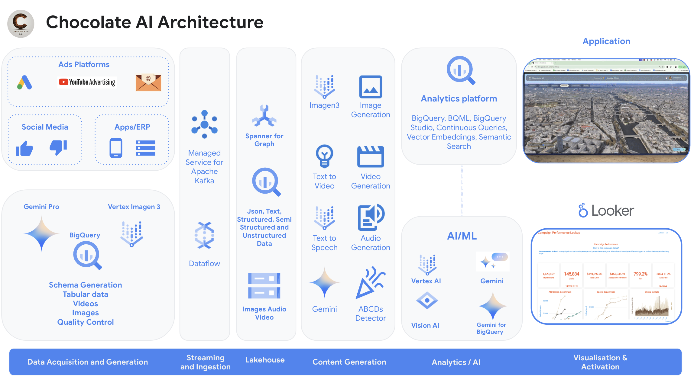

# Chocolate AI: Revolutionizing Marketing with Data Analytics and GenAI

Welcome to Chocolate AI, a cutting-edge demonstration of how Generative AI can revolutionize marketing on Google Cloud.  This project showcases the power of BigQuery, Gemini, Spanner and Vertex AI, transforming data analytics into a creative powerhouse. Explore our interactive web frontend demo (contact your account team or customer engineer for access) and dive into the backend code provided here.

This isn't just theory; it's a fully functional, end-to-end demo.  All code is available for you to explore, adapt, and innovate under the provided license agreement.

### Geofencing Marketing Campaign 

Managed Service for Apache Kafka, Dataflow, BigQuery (streaming ingestion) and BigQuery Continuous Queries (for real time analytics) that calls Gemini Pro


### Spanner Graph
Unlock deeper insights from your connected data. By using Reverse ETL to move data from BigQuery to Spanner Graph, you can easily explore complex relationships and patterns. Spanner Graph seamlessly combines the power of SQL with graph analysis, giving you a complete view of your data.


## Demo Overview

Chocolate AI simulates a Parisian chocolatier, using synthetic data and AI-generated media to demonstrate real-world marketing use cases.  Witness the art of the possible: personalized campaigns, captivating visuals, and data-driven insights, all powered by Google Cloud's Generative AI solutions.

## Unleash the Power of Generative AI Marketing

Chocolate AI, inspired by a Parisian chocolatier, uses synthetic data and AI-generated media to illustrate real-world marketing applications.  Imagine:

* **Personalized Campaigns:**  Connect with individual customer preferences at scale.
* **Compelling Visuals:** Captivate your audience with stunning AI-generated images and videos.
* **Data-Driven Insights:** Optimize your budget and maximize ROI with powerful analytics.
* **Streamlined Workflows:** Accelerate campaign development with AI-powered automation.
* **Future-Forward Approach:** Stay ahead of the curve with Google Cloud's cutting-edge AI solutions.

### Architecture


## Demo Cost and Usage

* **Idle Cost:** ~$1/day. Minimize by deleting the Colab Runtime and recreating when needed.
* **Notebook Execution:** ~$1 per run for GenAI and BigQuery notebooks. Costs scale with data volume.
* **BigQuery Reservation:** Requires a temporary reservation for Continuous Queries (delete after use).
* **Kafka Cluster:**  Requires a Kafka for BigQuery cluster (delete after use).
* **Spanner Graph** Default Spanner configuration with 100 processing units costs ~$3/day to leave running.

**Usage Notes:**

* Notebooks use the latest Gemini models.  Output may vary with model updates.  For production, pin to specific versions.
* Connect to the "colab-enterprise-runtime" within Colab.

## Notebook Deep Dive

Each notebook demonstrates a key aspect of the Chocolate AI solution.  Explore them below:

| Title | Description | Technology | Link |
|---|---|---|---|
| Campaign Customer Segmentation | Customer segmentation using embeddings and vector search in BigQuery.  Explore pre-defined segments and create dynamic segments based on semantic similarity. | Vertex AI Embeddings, Vector Search, Gemini Pro | [Create-Campaign-Customer-Segmentation](colab-enterprise/Create-Campaign-Customer-Segmentation.ipynb) |
| Multimodal Segment Recommendations | Use Gemini to analyze campaigns and recommend ideal customer segments based on text or video input. Leverage vector search to identify matches for new segments. | Gemini Pro (multimodal), Vector Search | [Create-Campaign-Multimodal-Segment-Recommendations](colab-enterprise/Create-Campaign-Multimodal-Segment-Recommendations.ipynb) |
| Campaign Naming | Generate creative campaign names based on analysis of marketing videos using Gemini's multimodal capabilities. | Gemini Pro (multimodal) | [Create-Campaign-Naming](colab-enterprise/Create-Campaign-Naming.ipynb) |
| Campaign Quality Control (ABCD Detector) | Evaluate campaign videos using Google's ABCD (Attract, Brand, Connect, Direct) framework. Leverage Video Intelligence API and Gemini for scoring and improvement suggestions. | ABCD Detector, Gemini Pro | [Create-Campaign-Quality-Control-ABCD](colab-enterprise/Create-Campaign-Quality-Control-ABCD.ipynb) |
| Campaign Recommendations | Generate marketing campaign recommendations using BigQuery, Gemini, and TimesFM for performance forecasting.  Identify underperforming products and simulate campaign outcomes. | Gemini Pro, TimesFM | [Create-Campaign-Recommendations](colab-enterprise/Create-Campaign-Recommendations.ipynb) |
| Campaign Target Channels | Optimize campaign budget allocation across different marketing channels using Gemini and TimesFM.  Simulate different scenarios to maximize profit. | Gemini Pro, TimesFM | [Create-Campaign-Target-Channels](colab-enterprise/Create-Campaign-Target-Channels.ipynb) |
| Hyper-Personalized Email | Create hyper-personalized emails with unique marketing text and AI-generated images tailored to customer interests and current events.  Includes translation and verification using Gemini. | Gemini Pro, Imagen3, Gemini (Language Translation) | [Campaign-Assets-Hyper-Personalized-Email](colab-enterprise/Campaign-Assets-Hyper-Personalized-Email.ipynb) |
| Text-to-Video (Human in the Loop) | Generate marketing videos using Gemini and Text-to-Video. Brainstorm concepts, create prompts, generate segments, and add AI-generated voiceovers in multiple languages. | Gemini, Text-to-Video | [Campaign-Assets-Text-to-Video-01 (Human in the Loop)](colab-enterprise/Campaign-Assets-Text-to-Video-01.ipynb) |
| Text-to-Video (Fully Automated) | Automate video creation with Gemini generating scripts and prompts, Text-to-Video generating segments, and AI adding voiceovers. Includes quality assurance checks with Gemini. | Gemini, Text-to-Video | [Campaign-Assets-Text-to-Video-02 (Fully automated)](colab-enterprise/Campaign-Assets-Text-to-Video-02.ipynb) |
| Create YouTube Short | Create YouTube Shorts from existing marketing videos using Gemini's multimodal analysis.  Incorporate best practices and generate tailored voiceovers. | Gemini Pro (multimodal) | [Campaign-Assets-Video-Create-Shorts](colab-enterprise/Campaign-Assets-Video-Create-Shorts.ipynb) |
| TimesFM Forecasting | Learn how to use TimesFM, a state-of-the-art LLM for time series forecasting, with a basic example. | TimesFM | [Campaign-Performance-Forecasting-TimesFM](colab-enterprise/Campaign-Performance-Forecasting-TimesFM.ipynb) |
| Geofencing Simulation | Simulate a real-time geofencing campaign using Kafka, Dataflow, BigQuery Continuous Queries, and Pub/Sub. Trigger targeted offers when customers enter designated areas. | Managed Service for Apache Kafka, Dataflow, BigQuery, Continuous Queries, Pub/Sub | [Campaign-Performance-Geofencing-Simulation](colab-enterprise/Campaign-Performance-Geofencing-Simulation.ipynb) |
| Data Insights | Leverage Data Insights to automatically generate SQL queries for data analysis. Use Gemini to uncover patterns, assess data quality, and perform statistical analysis. | Data Insights (uses Gemini) | [Campaign-Performance-Data-Insights](colab-enterprise/Campaign-Performance-Data-Insights.ipynb) |
| Spanner Graph | Leverage Spanner's graph capabilities for advanced analytics.  Create property graphs, perform collaborative filtering, discover brand partners, and integrate with BigQuery via external datasets and vector search. | Spanner Graph, Reverse ETL, External Datasets, Vector Search | [Campaign-Performance-Spanner-Graph](colab-enterprise/Campaign-Performance-Spanner-Graph.ipynb) |
| Campaign Customer Segmentation | Customer segmentation using embeddings and vector search in BigQuery. Explore pre-defined segments and create dynamic segments based on semantic similarity. | Vertex AI Embeddings, Vector Search, Gemini Pro | [Create-Campaign-Customer-Segmentation](colab-enterprise/Create-Campaign-Customer-Segmentation.ipynb) |
| Synthetic Data Generation: Campaigns | Generates synthetic data for marketing campaigns, including details, performance metrics, content, and recommendations. Simulates historical campaigns for analysis and testing. | Gemini Pro 1.5 (JSON schema), BigQuery | [Synthetic-Data-Generation-Campaigns](colab-enterprise/Synthetic-Data-Generation-Campaigns.ipynb) |
| Synthetic Data Generation: Customer Marketing Profile | Creates synthetic customer profiles, including demographics, social media activity, hobbies, purchase history, and marketing insights. | Gemini Pro 1.5 (JSON schema), BigQuery | [Synthetic-Data-Generation-Customer-Marketing-Profile](colab-enterprise/Synthetic-Data-Generation-Customer-Marketing-Profile.ipynb) |
| Synthetic Data Generation: Customer Reviews | Generates synthetic customer reviews for menu items, with positive, neutral, and negative sentiments. | Gemini Pro 1.5 (JSON schema), BigQuery | [Synthetic-Data-Generation-Customer-Reviews](colab-enterprise/Synthetic-Data-Generation-Customer-Reviews.ipynb) |
| Synthetic Data Generation: Customers | Generates synthetic customer data, including name, location, and other demographics. | Gemini Pro, Faker, BigQuery | [Synthetic-Data-Generation-Customers](colab-enterprise/Synthetic-Data-Generation-Customers.ipynb) |
| Synthetic Data Generation: Menu | Generates a synthetic menu with item names, descriptions, sizes, prices, allergy information, and AI-generated images using Imagen3. | Gemini Pro 1.5 (JSON schema), Imagen3, BigQuery | [Synthetic-Data-Generation-Menu](colab-enterprise/Synthetic-Data-Generation-Menu.ipynb) |
| Synthetic Data Generation: Orders | Generates synthetic order data, including order details and future orders, to ensure queries remain functional over time. | Gemini Pro, BigQuery | [Synthetic-Data-Generation-Orders](colab-enterprise/Synthetic-Data-Generation-Orders.ipynb) |


## Sample Chocolate AI Geneated Menu Images using Imagen3


## How to deploy
The are two options to deploy the demo depending on your access privilages to your cloud organization

### Require Permissions to Deploy (2 Options)
1. Elevated Privileges - Org Level
   - **The following IAM roles are required to deploy the solution**
      - Prerequisite:  Billing Account User (to create the project with billing)
   - To deploy the code you will:
      - Run ```source deploy.sh```

2. Owner Project Privileges - Typically Requires Assistance from IT
   - **The following items are required to deploy the solution**
      - Prerequisite: You will need a project created for you (IT can do this for you)
      - Prerequisite: You will need to be an Owner (IAM role) of the project to run the below script
   - To deploy the code you will
      - Update the hard coded values in ```deploy-use-existing-project-non-org-admin.sh```
      - Run ```source deploy-use-existing-project-non-org-admin.sh```


### Using your Local machine (Assuming Linux based)
1. Install Git (might already be installed)
2. Install Curl (might already be installed)
3. Install "jq" (might already be installed) - https://jqlang.github.io/jq/download/
4. Install Google Cloud CLI (gcloud) - https://cloud.google.com/sdk/docs/install
5. Install Terraform - https://developer.hashicorp.com/terraform/install
6. Login:
   ```
   gcloud auth login
   gcloud auth application-default login
   ```
7. Type: ```git clone https://github.com/GoogleCloudPlatform/chocolate-ai```
8. Switch the prompt to the directory: ```cd chocolate-ai```
9. Run the deployment script
   - If using Elevated Privileges
      - Run ```source deploy.sh```
   - If using Owner Project Privileges
      - Update the hard coded values in ```deploy-use-existing-project-non-org-admin.sh```
      - Run ```source deploy-use-existing-project-non-org-admin.sh```
10. Authorize the login (a popup will appear)
11. Follow the prompts: Answer “Yes” for the Terraform approval.


### To deploy through a Google Cloud Compute VM
1. Create a new Compute VM with a Public IP address or Internet access on a Private IP
   - The default VM is fine (e.g.)
      - EC2 machine is fine for size
      - OS: Debian GNU/Linux 12 (bookworm)
2. SSH into the machine.  You might need to create a firewall rule (it will prompt you with the rule if it times out)   
3. Run these commands on the machine one by one:
   ```
   sudo apt update
   sudo apt upgrade -y
   sudo apt install git
   git config --global user.name "FirstName LastName"
   git config --global user.email "your@email-address.com"
   git clone https://github.com/GoogleCloudPlatform/chocolate-ai
   cd chocolate-ai/
   sudo apt-get install apt-transport-https ca-certificates gnupg curl
   sudo apt-get install jq
   gcloud auth login
   gcloud auth application-default login
   sudo apt-get update && sudo apt-get install -y gnupg software-properties-common
   wget -O- https://apt.releases.hashicorp.com/gpg | gpg --dearmor | sudo tee /usr/share/keyrings/hashicorp-archive-keyring.gpg > /dev/null
   gpg --no-default-keyring --keyring /usr/share/keyrings/hashicorp-archive-keyring.gpg --fingerprint
   echo "deb [signed-by=/usr/share/keyrings/hashicorp-archive-keyring.gpg] \
   https://apt.releases.hashicorp.com $(lsb_release -cs) main" | sudo tee /etc/apt/sources.list.d/hashicorp.list
   sudo apt update
   sudo apt-get install terraform

   source deploy.sh 
   # Or 
   # Update the hard coded values in deploy-use-existing-project-non-org-admin.sh
   # Run source deploy-use-existing-project-non-org-admin.sh
   ```

### Cloud Shell (NOT WORKING) 
1. Open a Google Cloud Shell: http://shell.cloud.google.com/
2. Type: ```git clone https://github.com/GoogleCloudPlatform/chocolate-ai```
3. Switch the prompt to the directory: ```cd chocolate-ai```
4. Run the deployment script
   - If using Elevated Privileges
      - Run ```source deploy.sh```
   - If using Owner Project Privileges
      - Update the hard coded values in ```deploy-use-existing-project-non-org-admin.sh```
      - Run ```source deploy-use-existing-project-non-org-admin.sh```
5. Authorize the login (a popup will appear)
6. Follow the prompts: Answer “Yes” for the Terraform approval