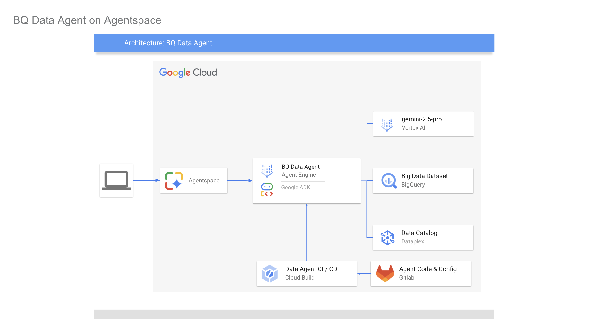
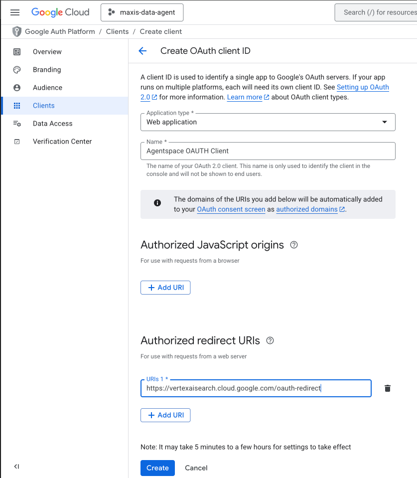
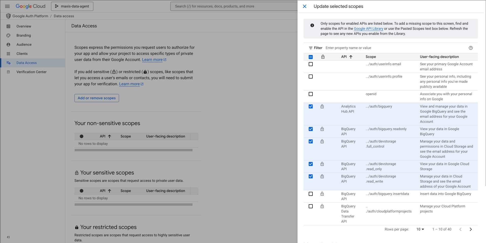
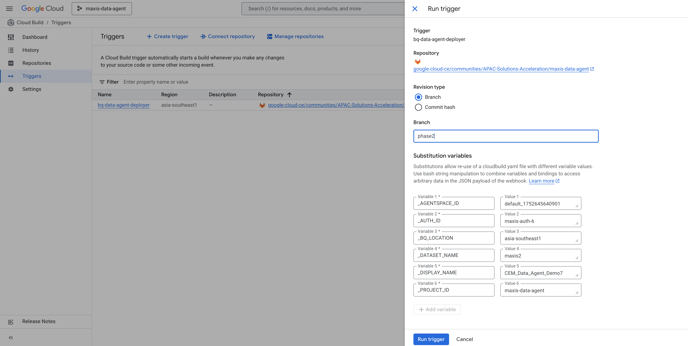

# BigQuery Data Agent



This project contains a configurable and deployable AI agent built with the Google Agent Development Kit (ADK). The agent is designed to answer natural language questions about data stored in Google BigQuery by dynamically generating and executing SQL queries.

It can be configured to point to different BigQuery datasets, making it a reusable framework for various data analysis use cases. When deployed, it can automatically register itself with a specified **Agentspace** application.

---

## Project Owners

Please reach out to the team below if you have any questions:

- [Aishwarya Prabhat](https://moma.corp.google.com/person/aishprabhat)
- [Seonhwa (Sona) Hwang](https://moma.corp.google.com/person/seonhwah)
- [Sudipto Guha](https://moma.corp.google.com/person/sudiptoguha)
- [Dharini Chandrashekhar](https://moma.corp.google.com/person/dharinic)

---

## Table of Contents
- [Prerequisites](#prerequisites)
- [How It Works](#how-it-works)
- [Key Files and Directories](#key-files-and-directories)
- [Scripts and Deployment Internals](#scripts-and-deployment-internals)
- [Dynamic Prompt Construction](#dynamic-prompt-construction)
- [Data Readiness](#data-readiness)
- [Enabling Authorization (OAuth 2.0)](#enabling-authorization-oauth-20)
- [Running the Agent Locally (for Testing)](#running-the-agent-locally-for-testing)
- [Deployment Methods](#deployment-methods)
  - [Method 1: 1-Click Deployment via Cloud Build UI (Recommended)](#method-1-1-click-deployment-via-cloud-build-ui-recommended)
  - [Method 2: Fully Automated CI/CD with Git Triggers](#method-2-fully-automated-cicd-with-git-triggers)
  - [Method 3: Manual Deployment from Local Machine](#method-3-manual-deployment-from-local-machine)
- [Observability and Tracing](#observability-and-tracing)
- [Configuration](#configuration)

---

## Prerequisites

- **Google Cloud SDK**: Ensure `gcloud` is installed and you have authenticated by running `gcloud auth login`.
- **Python 3.10+**: With `venv` for managing virtual environments.
- **Permissions**: Your user account and the service accounts used for deployment and runtime require specific IAM roles. See the detailed setup sections for each deployment method.

---

## How It Works

The agent uses a combination of static instructions and dynamic, real-time context to understand user queries and interact with BigQuery.

1.  **Configuration (`agent_configs/`)**: Shell scripts define environment variables that point the agent to a specific BigQuery dataset, GCP project, Agentspace application, and other settings. For UI-based deployments, these are set using Cloud Build substitution variables.
2.  **Dynamic Prompt Construction (`instructions.py`, `instructions.yaml`)**: The agent is given a detailed set of instructions on how to behave. At startup, it dynamically fetches live context about the target data and injects it into a master prompt template.
3.  **Tool (`custom_tools.py`)**: The agent's primary tool is `execute_bigquery_query`, which allows it to run the SQL it generates against BigQuery.
4.  **Deployment (`deployment/`, `scripts/`, `cloudbuild.yaml`)**: The project supports multiple deployment methods, with the recommended approach being a reusable "1-click" trigger in the Cloud Build UI.

---

## Key Files and Directories

-   **`data_agent/`**: This is the core Python source code for the agent.
    -   `agent.py`: Contains the main `DataAgent` class that initializes the agent, loads tools, and processes instructions.
    -   `instructions.yaml`: The master prompt template. It defines the agent's persona, workflow, and rules for generating SQL.
    -   `instructions.py`: A helper module responsible for loading the `instructions.yaml` template and dynamically injecting live context (table schemas, data profiles) into it before passing it to the agent.
    -   `custom_tools.py`: Defines the custom tools available to the agent. The most important tool is `execute_bigquery_query`, which grants the agent the ability to run SQL against BigQuery.
    -   `utils.py`: A collection of utility functions that fetch the dynamic context from Google Cloud services like BigQuery and Dataplex.

-   **`agent_configs/`**: This directory holds the configuration files for different agent instances, primarily for local testing.
    -   `_config.sh` (e.g., `cem_config.sh`): These shell scripts define environment variables that control the agent's behavior, such as the target GCP project, BigQuery dataset, and display name. You can create new files here to configure agents for different datasets.

-   **`scripts/`**: This directory contains operational scripts for running, deploying, and managing the agent.
    -   `deploy.sh`: A comprehensive script for manually deploying the agent to Vertex AI Agent Engine and registering it with Agentspace.
    -   `run_local.sh`: Allows you to run the agent on your local machine for testing and debugging, using your local `gcloud` credentials.
    -   `agentspace_auth.sh`: A critical one-time script to set up the OAuth 2.0 configuration in Agentspace, enabling the agent to act on behalf of a user.

-   **`deployment/`**: Contains Python scripts used by the deployment process.
    -   `deploy_agentengine.py`: The underlying Python script called by `deploy.sh` to handle the API calls for creating and updating the agent in Vertex AI.

-   **`cloudbuild.yaml`**: The configuration file for Google Cloud Build. It defines the CI/CD pipeline for automated testing and deployment, providing a repeatable and secure way to deploy the agent. This file is central to the recommended UI-based deployment method.

---

## Scripts and Deployment Internals

This section details the purpose and execution flow of the key scripts responsible for testing, deploying, and managing the agent.

-   **`scripts/run_local.sh`**
    -   **Purpose**: To test the agent on your local machine without needing to deploy it to the cloud.
    -   **Execution Flow**: This script accepts a single argument: the path to a configuration file (e.g., `agent_configs/cem_config.sh`). It uses the `source` command to load the environment variables from that file and then executes `adk web` to start the ADK's local development server, which provides a web UI for chatting with your agent.

-   **`scripts/deploy.sh`**
    -   **Purpose**: To manually trigger a full deployment of the agent from your local machine. It acts as a user-friendly wrapper around the core Python deployment logic.
    -   **Execution Flow**: It requires a config file path and an action (`create`, `register`, or `delete`). The script first loads the environment variables from the config file. It then builds the agent's Python code into a wheel package (`.whl`). Finally, it calls the `deployment/deploy_agentengine.py` script, passing the action and any other arguments to it.

-   **`scripts/agentspace_auth.sh`**
    -   **Purpose**: A critical, one-time setup script to register the agent's OAuth 2.0 credentials with Agentspace. This is what enables the "act on behalf of user" functionality.
    -   **Execution Flow**: The script uses `curl` to send a `POST` request to the Google Discovery Engine API endpoint. It's idempotent; if the authorization configuration already exists (which results in a `409 ALREADY_EXISTS` error), it automatically retries with a `PATCH` request to update the existing configuration. This script is run automatically as part of the `cloudbuild.yaml` pipeline.

-   **`scripts/cloud_build_deploy.sh`**
    -   **Purpose**: A specialized version of `deploy.sh` designed to be run within the Google Cloud Build environment.
    -   **Execution Flow**: This script is very similar to `deploy.sh` but is tailored for the CI/CD environment. It sets the necessary `PATH` variables for the Cloud Build environment, builds the Python wheel, and then executes `deployment/deploy_agentengine.py`. It assumes all its configuration is provided by the Cloud Build trigger's substitution variables.

-   **`deployment/deploy_agentengine.py`**
    -   **Purpose**: This is the core deployment logic. This Python script makes the actual API calls to Google Cloud to create, register, and delete the agent.
    -   **Execution Flow**: It uses `argparse` to determine the action to perform (`create`, `register`, `delete`).
        -   **`create`**: It initializes the Vertex AI SDK, creates a Cloud Storage bucket for staging if needed, and then calls `vertexai.agent_engines.create()` to deploy the agent application. It passes the environment variables from the config/trigger to the agent engine.
        -   **`register`**: It takes the full resource name of an existing agent and uses the `requests` library to make a `POST` call to the Discovery Engine API, registering the agent with the specified Agentspace application.
        -   **`delete`**: It uses the Vertex AI SDK to find and delete the specified agent engine.

---

## Dynamic Prompt Construction
The agent's "brain" is the master prompt it receives at initialization. This prompt isn't static; it's built on-the-fly to provide the AI model with the freshest possible context about your data, which is key to its accuracy.

Here’s how the final prompt is assembled:
1.  **Static Template (`instructions.yaml`)**: Provides the skeleton of the prompt, including the core workflow and rules for generating SQL.
2.  **Live Data Fetching (`utils.py`)**: The script calls utility functions to fetch live context from Google Cloud:
    -   **Dataset, Table, and Column Descriptions**: Fetches rich, descriptive business context from BigQuery and Dataplex.
    -   **Data Profiles**: Queries a table to get statistical profiles of columns (e.g., top values, null percentages).
    -   **Few-Shot Examples**: Queries a table for curated question-and-SQL pairs to guide the model.
3.  **Prompt Assembly**: The fetched information is formatted and injected into the template, creating a comprehensive prompt.

---

## Data Readiness

**Why is the business & data context layer critical for enterprise success of Data Agents?**

Business & Data context is **absolutely critical** for conversational analytics agents. Without it, these agents would be little more than glorified search engines or basic data query tools, providing generic answers that lack real business value.

Here's why business context is so important for conversational analytics agents:

1.  **Accurate Interpretation of User Intent & Domain-Specific Language (NLU):**
    *   **Problem without context:** Users use company-specific jargon, acronyms, and product names (e.g., "Opex savings," "Project Wolverine," "QBR deck"). A general-purpose LLM wouldn't know what these refer to or which data points they map to. "Show me revenue" is ambiguous: Gross revenue, net revenue, recurring revenue? For which product, region, or time period?
    *   **Solution with context:** The agent understands that "Opex" refers to "Operational Expenses," "Project Wolverine" is a specific initiative with associated data in the project management system, and "QBR deck" means they need insights relevant to Quarterly Business Reviews. It can infer the most likely "revenue" metric based on the user's role or typical queries.
2.  **Precise Data Query Generation & Schema Mapping:**
    *   **Problem without context:** Even if the agent understands "sales," it won't know which database table, column, or specific metric (e.g., Sales\_Amount in Fact\_Sales table vs. Booking\_Value in CRM\_Opportunities). It won't know default aggregations (sum, average) or timeframes (current quarter, last month).
    *   **Solution with context:** The agent has a mapping of business terms to the underlying data schema (data model). It knows "sales" maps to Fact\_Sales.Sales\_Amount, "customers" might mean Dim\_Customer.CustomerID, and "profit margin" is a calculated field ((Revenue \- Cost) / Revenue). It can apply standard filters and aggregations relevant to the business.
3.  **Meaningful Insight Generation & Explanation:**
    *   **Problem without context:** The agent might tell you "Sales are down by 10%." Without context, this is just a number. Is it good or bad? Is it expected? Why is it happening?
    *   **Solution with context:** The agent knows the company's KPIs, targets, strategic initiatives, and even recent market events. It can respond: "Sales are down by 10%, which is below our target of a 5% increase. This decline is primarily driven by lower conversion rates in the EMEA region for Product X, possibly due to the recent competitor launch mentioned in our Q3 review." It can highlight *why* a particular number is significant.
4.  **Effective Ambiguity Resolution & Follow-Up Questions:**
    *   **Problem without context:** User asks, "What about last month?" The agent doesn't know "last month what?" Sales? Marketing spend? Employee churn?
    *   **Solution with context:** The agent maintains conversational state and infers based on the previous turn. If the user just asked about "Q3 sales," "What about last month?" likely refers to "last month's sales," or it can provide relevant clarifying options: "Do you mean last month's sales, or marketing spend, or something else?"
5.  **Tailored User Experience & Personalization:**
    *   **Problem without context:** A marketing analyst asking about "campaign performance" gets the same generic answer as a finance analyst asking about "budget utilization."
    *   **Solution with context:** The agent can understand the user's role, department, and typical analytical needs. It can prioritize metrics, visualizations, and insights that are most relevant to *that specific user*, even suggesting proactive insights based on their past queries.
6.  **Enhanced Trust & Adoption:**
    *   **Problem without context:** Frequent errors, irrelevant answers, or a lack of depth lead to user frustration and abandonment.
    *   **Solution with context:** When the agent consistently provides accurate, relevant, and insightful answers in language the user understands, it builds trust. Users feel it "gets" their business, leading to higher adoption and reliance as a valuable analytical tool.
7.  **Adherence to Governance, Security, & Compliance:**
    *   **Problem without context:** The agent might accidentally expose sensitive data or provide information to an unauthorized user.
    *   **Solution with context:** Business context includes data governance rules, role-based access controls, and compliance requirements (e.g., GDPR, HIPAA). The agent knows which data points are sensitive, who has access to what, and what reporting standards must be met. "As an individual contributor, I cannot show you salary details for specific employees, but I can provide aggregated departmental cost breakdowns."

**Preparing your (Structured) Data for Conversational Analytics use cases: How Business Context is Implemented in Data Agents on GCP:**

*   **Knowledge Graphs & Ontologies:** Mapping business terms, relationships, and hierarchies (e.g., "North America" is a "Region," which contains "Countries," which contain "States/Provinces").
*   **Data Model Mapping/Schema Definition:** Explicitly linking business concepts to underlying database tables, columns, and metric definitions.
*   **Fine-tuning LLMs:** Training the language model on company-specific documents, internal communications, and historical conversations to embed the unique linguistic patterns and domain knowledge.
*   **Retrieval Augmented Generation (RAG):** Supplementing the LLM's general knowledge with real-time Lookups from internal knowledge bases, policy documents, and data dictionaries.
*   **User Feedback & Reinforcement Learning:** Continuously learning from user interactions, corrections, and explicit feedback to refine its understanding of context.

In essence, business context transforms a conversational analytics agent from a novelty into a strategic asset, enabling it to deliver actionable intelligence that drives better decision-making within the organization.

**How to build the data & business context layer for BigQuery**

### **Few-Shot Examples**

Providing examples helps the agent understand typical user queries and desired responses.

**What:** This involves supplying **5-10 SQL examples of typical queries** users might pose to the agent. These examples serve as a training set, demonstrating the expected input format and the corresponding accurate output.

**How:** These examples can be sourced from **BigQuery Dataset Insights**, which provide a repository of relevant and well-formed query examples. Table level SQL queries can be found (GA), while dataset level SQL queries can need allowlisting (see GTM deck for details)

---

### **BigQuery Table Context**

This is crucial for the agent to understand the underlying data structure.

**What:** It encompasses detailed information about the database tables, including their **schema, column descriptions, metadata, and data types**. This allows the agent to correctly interpret data elements and their relationships.

**How:** This context is generated through **BigQuery commands** produced by the model itself, ensuring that the agent has an accurate and up-to-date understanding of the data landscape.

---

### **Customer Use-Case Specific Info**

Tailoring the agent to specific business needs requires domain-specific knowledge.

**What:** This category includes **common questions, use-case terminology, and important fields** relevant to specific customer scenarios. This helps the agent understand the nuances of particular business operations and user inquiries.

**How:** This information is typically **manually collected from Subject Matter Experts (SMEs)** within the organization and can be documented in a **Dataplex Business Glossary**, ensuring accuracy and consistency.

---

### **Table Relationships**

Understanding how data tables connect is vital for complex queries.

**What:** It defines **how tables are related**, including entity relationships, join keys, and different types of associations between tables. This enables the agent to perform multi-table queries and retrieve interconnected data accurately.

**How:** This relational data is pulled directly from **BigQuery Data Insights**, which provides a comprehensive view of the interdependencies within your dataset. Since this information isn’t available via an API yet, you will manually need to add it to the Dataset description.

---

### **Data Profiles**

Detailed data characteristics enhance the agent's analytical capabilities.

**What:** This involves providing **data profile results**, such as column statistics, value distributions, distinct values, row counts, table sizes, and data patterns. This allows the agent to understand the nature and quality of the data it's working with.

**How:** This information is obtained from **BigQuery Data Profiles**, which automatically generate detailed insights into the characteristics of your datasets.

**Datasets available to use with the BQ-Data Agent**

| Domain | Link | Description | |
| :---- | :---- | :---- | :---- |
| Telco | [Link](https://drive.google.com/drive/folders/1AeB3i0tg3DR9TwrOio5YoWrTV0Xntd5w?usp=drive_link) | |
| Ecommerce | [Link](https://console.cloud.google.com/bigquery/analytics-hub/discovery/projects/1057666841514/locations/us/dataExchanges/google_cloud_public_datasets_17e74966199/listings/thelook_ecommerce) | TheLook is a fictitious eCommerce clothing site developed by the Looker team. The dataset contains information about customers, products, orders, logistics, web events and digital marketing campaigns. | |
| Consumer goods (Coffee chain) | (Search for Data Beans on Analytics hub)  | Databeans: Data for the Data Beans fictitious company of coffee trucks. This dataset contains information about a coffee business, encompassing various aspects of its operations. It includes details about locations, cities, and their addresses, as well as historical location data. The dataset also provides information about coffee farms, processors, and roasters, including their contact details and geographic locations. Furthermore, it stores menu information, customer details, order history, and customer feedback. This data can be used to analyze sales trends, customer behavior, supply chain logistics, and identify areas for business improvement. | |
| FSI | [Link](https://gitlab.com/google-cloud-ce/googlers/pkeny/customer-insights-platform/-/tree/main/business-performance-dashboards/tables?ref_type=heads) | This dataset provides a comprehensive view of user interactions, advertising campaigns, and customer information. It includes details on website events, user demographics, and advertising performance. Loan data is also captured, providing insights into loan terms and financial status. Customer attributes such as churn score and lifetime value are recorded, enabling personalized customer experiences. The dataset supports analysis of user behavior, campaign effectiveness, and customer segmentation, and can be used to optimize marketing strategies and improve customer retention. | |
| Google Analytics | bigquery-public-data.ga4\_obfuscated\_sample\_ecommerce | Obfuscated Google Analytics 4 data emulating a web ecommerce implementation of Google Analytics. It’s a great way to look at business data and experiment and learn the benefits of analyzing Google Analytics data in BigQuery. Learn more at: [Link](https://developers.google.com/analytics/bigquery/web-ecommerce-demo-dataset) | |
| SFDC | Coming soon\! | | |

---

## Enabling Authorization (OAuth 2.0)
To allow the agent to act on behalf of the end-user (e.g., querying BigQuery tables the user has access to but the agent's service account does not), you must configure OAuth 2.0. This is a prerequisite for any deployment that requires user-level permissions.

*The original guide for enabling auth in Agentspace can be found [here](https://drive.google.com/file/d/1BSbt_UUNdzy5YvEVuDez7RihMdJ6pbul/view?resourcekey=0-IYbPfqERhbtRzSu_gvHy6A).*

### Step 1: Create OAuth 2.0 Credentials (One-Time Setup)
1.  Navigate to the **[Credentials page](https://console.cloud.google.com/apis/credentials)** in the Google Cloud Console.
2.  Click **+ CREATE CREDENTIALS** and select **OAuth client ID**.
3.  For **Application type**, select **Web application**.
4.  Under **Authorized redirect URIs**, you **MUST** add `https://vertexaisearch.cloud.google.com/oauth-redirect`. This is the endpoint Agentspace uses to complete the OAuth flow.
    
5.  After creation, take note of the **Client ID** and **Client Secret**.
6.  Configure the **OAuth consent screen** and add the necessary scopes your agent needs to function.
    

### Step 2: Register Authorization with Agentspace via Script
Once you have your OAuth Client ID and Secret, you must register them with Agentspace. This project provides a powerful, idempotent script at `scripts/agentspace_auth.sh` to automate this one-time setup. The `cloudbuild.yaml` pipeline runs this for you automatically.

#### **What the Script Does**
The script communicates with the Discovery Engine API to create an "Authorization Resource". This resource securely stores your OAuth configuration and links it to a unique Authorization ID (`AUTH_ID`). This ID is later used by the agent deployment process to enable user-level permissions.

-   **Idempotent Logic**: The script is safe to run multiple times. It first tries to create the resource. If it receives a `409 ALREADY_EXISTS` error, it automatically switches to updating the existing resource with a `PATCH` request. This makes it ideal for CI/CD pipelines.
-   **Dynamic URI Construction**: It programmatically builds the full `OAUTH_AUTH_URI`, including all necessary parameters for a successful flow.
-   **Regional Endpoint Awareness**: It correctly targets the regional or global API endpoint based on the `AUTH_LOCATION` variable.

#### **How to Use the Script Manually**
This is typically run automatically by Cloud Build. However, to run it manually:
1.  **Open the Script**: Navigate to and open `scripts/agentspace_auth.sh`.
2.  **Edit the Configuration**: Fill in all the variables in the `--- CONFIGURATION ---` block.
3.  **Run the Script**: Execute from your terminal. A successful run will print a `200 OK` status.
    ```bash
    bash scripts/agentspace_auth.sh
    ```

### Step 3: Configure the Agent to Use Auth
Finally, ensure the agent's configuration points to the authorization you just registered. This is handled automatically by the Cloud Build substitution variables or the `_config.sh` files.

---

## Running the Agent Locally (for Testing)
This method is for quick testing and debugging on your local machine. It uses the ADK web server to provide an interface for interacting with your agent. It does not deploy the agent to the cloud.

1.  **Configure a Test Agent**:
    * Open a configuration file like `agent_configs/cem_config.sh`.
    * Fill in the environment variables with your GCP project details and the target BigQuery dataset you want to test against.

2.  **Create a Environment**:
    * Create and activate a virtual environment.
    ```bash
    python3 -m venv venv
    source venv/bin/activate
    ```
    * Install dependencies.
    ```bash
    pip install -r requirements.txt
    ```
    * Create a .env file with the following variables.
    ```bash
    export GOOGLE_API_KEY=
    export GOOGLE_GENAI_USE_VERTEXAI=0
    ```
    
3.  **Run the Local Server**:
    * The `run_local.sh` script sources the variables from your chosen config file and starts the ADK web server.
    ```bash
    bash scripts/run_local.sh agent_configs/cem_config.sh
    ```
    * This will launch a web interface where you can chat with your agent and see its responses in real-time.

---

## Deployment Methods

### Method 1: 1-Click Deployment via Cloud Build UI (Recommended)
This method provides a powerful, reusable "1-click" deployment process directly from the Google Cloud Console. After an initial one-time setup of a Cloud Build trigger, you can deploy new, distinct instances of the Data Agent for different datasets simply by changing a few variables in the UI and clicking "Run".

This is the recommended approach for managing multiple data agents from a single codebase.



#### **One-Time Setup**

1.  **Grant IAM Permissions**: Ensure the Cloud Build Service Account and the Agent Runtime Service Account have the necessary permissions as detailed in the **IAM Setup for Cloud Build** section below.

2.  **Store OAuth Secret**: Store your `OAUTH_CLIENT_SECRET` in Google Secret Manager with the name `OAUTH_CLIENT_SECRET`. The Cloud Build pipeline is configured to access this secret securely.

3.  **Connect Your Git Repository to Cloud Build**:
    * Navigate to the **[Cloud Build Triggers](https://console.cloud.google.com/cloud-build/triggers)** page in your GCP project.
    * Connect your Git provider (e.g., GitLab, GitHub, Bitbucket) as a source repository. For detailed instructions, see the official documentation (e.g., for [connecting a GitLab repository](https://cloud.google.com/build/docs/automating-builds/gitlab/build-repos-from-gitlab)).

4.  **Create the Cloud Build Trigger**:
    * Click **CREATE TRIGGER**.
    * Give it a name (e.g., `deploy-data-agent`).
    * Select the Git repository you just connected.
    * For **Configuration**, choose `Cloud Build configuration file (yaml or json)`.
    * Set the **Location** to your `cloudbuild.yaml` file within the repository.
    * Under **Advanced > Substitution variables**, you will see the variables defined in `cloudbuild.yaml` (e.g., `_DATASET_NAME`). You can set defaults, but the main goal is to override them at runtime.
    * Click **CREATE**.

#### **Deploying or Re-deploying an Agent**

With the trigger created, deploying a new agent is simple:

1.  Navigate to the **[Cloud Build Triggers](https://console.cloud.google.com/cloud-build/triggers)** page.
2.  Find your `deploy-data-agent` trigger and click **RUN**.
3.  A dialog box will appear, allowing you to override the default substitution variables.
4.  **Fill in the new agent's details**:
    * `_DATASET_NAME`: The name of the new BigQuery dataset to target.
    * `_DISPLAY_NAME`: The user-facing name for this new agent.
    * `_AGENT_DESCRIPTION`: A description for this new agent.
    * `_AGENTSPACE_ID`: The Agentspace application to register this agent with.
5.  Click **RUN TRIGGER**.

Cloud Build will now execute the pipeline defined in `cloudbuild.yaml`, using your specified variables to configure and deploy a new, distinct agent instance.

**Example**: To deploy a second agent for a `finance_data` dataset, you would simply run the same trigger again with `_DATASET_NAME` set to `finance_data`, `_DISPLAY_NAME` to `Finance Data Agent`, and so on. This allows you to maintain one central agent codebase while easily managing multiple specialized agent deployments.

---

### Method 2: Fully Automated CI/CD with Git Triggers
The CI/CD pipeline in `cloudbuild.yaml` can be configured to run automatically on every commit to a specific branch. This is ideal for a full CI/CD workflow where every change is tested and deployed.

-   **IAM for Cloud Build**: The Cloud Build service account needs extensive permissions, including the `Secret Manager Secret Accessor` role to access your OAuth secret.
    ```bash
    # Replace YOUR_PROJECT_ID and PROJECT_NUMBER
    gcloud projects add-iam-policy-binding YOUR_PROJECT_ID --member="serviceAccount:service-PROJECT_NUMBER@gcp-sa-cloudbuild.iam.gserviceaccount.com" --role="roles/aiplatform.admin"
    gcloud projects add-iam-policy-binding YOUR_PROJECT_ID --member="serviceAccount:service-PROJECT_NUMBER@gcp-sa-cloudbuild.iam.gserviceaccount.com" --role="roles/storage.admin"
    gcloud projects add-iam-policy-binding YOUR_PROJECT_ID --member="serviceAccount:service-PROJECT_NUMBER@gcp-sa-cloudbuild.iam.gserviceaccount.com" --role="roles/discoveryengine.admin"
    gcloud projects add-iam-policy-binding YOUR_PROJECT_ID --member="serviceAccount:service-PROJECT_NUMBER@gcp-sa-cloudbuild.iam.gserviceaccount.com" --role="roles/iam.serviceAccountUser"
    gcloud projects add-iam-policy-binding YOUR_PROJECT_ID --member="serviceAccount:service-PROJECT_NUMBER@gcp-sa-cloudbuild.iam.gserviceaccount.com" --role="roles/secretmanager.secretAccessor"
    ```
-   **IAM for Agent Runtime**: The agent's runtime service account (`service-PROJECT_NUMBER@gcp-sa-aiplatform-cc.iam.gserviceaccount.com`) needs permissions to query your data.
    ```bash
    # Permissions to query BigQuery and read Dataplex metadata
    gcloud projects add-iam-policy-binding YOUR_PROJECT_ID --member="serviceAccount:service-PROJECT_NUMBER@gcp-sa-aiplatform-cc.iam.gserviceaccount.com" --role="roles/bigquery.dataViewer"
    gcloud projects add-iam-policy-binding YOUR_PROJECT_ID --member="serviceAccount:service-PROJECT_NUMBER@gcp-sa-aiplatform-cc.iam.gserviceaccount.com" --role="roles/bigquery.jobUser"
    gcloud projects add-iam-policy-binding YOUR_PROJECT_ID --member="serviceAccount:service-PROJECT_NUMBER@gcp-sa-aiplatform-cc.iam.gserviceaccount.com" --role="roles/dataplex.metadataReader"
    ```
-   **To Deploy**: Simply configure your Cloud Build trigger to run on a push to a specific branch (e.g., `main`).

### Method 3: Manual Deployment from Local Machine
You can deploy directly from your local machine using the `deploy.sh` script.

#### **One-Time IAM Setup for Manual Deployment**
Your user account needs the following roles:
```bash
# Replace YOUR_PROJECT_ID and your-email@example.com
gcloud projects add-iam-policy-binding YOUR_PROJECT_ID --member="user:your-email@example.com" --role="roles/discoveryengine.admin"
gcloud projects add-iam-policy-binding YOUR_PROJECT_ID --member="user:your-email@example.com" --role="roles/iam.serviceAccountUser"
gcloud projects add-iam-policy-binding YOUR_PROJECT_ID --member="user:your-email@example.com" --role="roles/aiplatform.admin"
```

#### **Manual Deployment Steps**
1.  **Set up Virtual Environment and Install Dependencies**.
2.  **Configure your Agent** in the `agent_configs/` directory.
3.  **Handle the OAuth Secret (IMPORTANT!)**: **Do not hardcode secrets.** Export it into your terminal session before you deploy:
    ```bash
    export OAUTH_CLIENT_SECRET="GOCSPX-..."
    ```
4.  **Run the Deployment Script**: The `deploy.sh` script handles all actions.
    -   Create & Register: `bash scripts/deploy.sh agent_configs/cem_config.sh create register`
    -   Create Only: `bash scripts/deploy.sh agent_configs/cem_config.sh create`
    -   Register an Existing Agent: `bash scripts/deploy.sh agent_configs/cem_config.sh register "projects/..."`
    -   Delete: `bash scripts/deploy.sh agent_configs/cem_config.sh delete "projects/..."`

---

## Observability and Tracing
To debug your agent and monitor its performance, you can enable Cloud Trace. This will export execution traces from the Agent Engine to Cloud Trace, allowing you to visualize the tool calls, LLM interactions, and latency for each request.

The full instructions for enabling and viewing traces can be found in the official Google Cloud documentation:
[Manage tracing for your agent](https://cloud.google.com/vertex-ai/generative-ai/docs/agent-engine/manage/tracing?_gl=1*1wnew2g*_ga*MjQ4OTIxMDc5LjE3NTI0ODYyMDU.*_ga_WH2QY8WWF5*czE3NTMwNjI5NTckbzYkZzEkdDE3NTMwNjMxOTQkajIzJGwwJGgw)

As part of the setup, ensure that tracing is enabled when the agent application is initialized within `deployment/deploy_agentengine.py`. This is done by setting the `enable_tracing` parameter to `True`:

```python
# In deployment/deploy_agentengine.py
adk_app = AdkApp(agent=root_agent, enable_tracing=True)
```

---

## Configuration
The agent's behavior is controlled by the `_config.sh` files (for local runs) or Cloud Build substitution variables (for cloud deployments).

-   **PROJECT_ID / PROJECT_NUMBER**: Your GCP Project identifiers.
-   **BQ_LOCATION / AE_LOCATION**: The regions for BigQuery and the Agent Engine.
-   **AUTH_LOCATION / AUTH_ID**: The location and ID for the OAuth configuration.
-   **OAUTH_CLIENT_ID / OAUTH_CLIENT_SECRET**: Your OAuth credentials.
-   **AGENTSPACE_ID**: The ID of the Agentspace application for registration.
-   **DATASET_NAME**: The BigQuery dataset to use.
-   **DATA_PROFILES_TABLE_FULL_ID**: Full ID of the table containing column statistics.
-   **FEW_SHOT_EXAMPLES_TABLE_FULL_ID**: Full ID of the table containing few-shot examples.
-   **DISPLAY_NAME**: The agent's user-facing name.
-   **AGENT_DESCRIPTION**: A brief description of the agent's purpose.